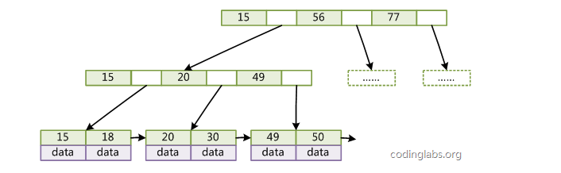

<!-- GFM-TOC -->
* [一、存储引擎](#一存储引擎)
    * [InnoDB](#innodb)
    * [MyISAM](#myisam)
    * [比较](#比较)
* [二、数据类型](#二数据类型)
    * [整型](#整型)
    * [浮点数](#浮点数)
    * [字符串](#字符串)
    * [时间和日期](#时间和日期)
* [三、索引](#三索引)
    * [B+ Tree 原理](#b-tree-原理)
    * [索引分类](#索引分类)
    * [索引的优点](#索引的优点)
    * [索引优化](#索引优化)
* [四、查询性能优化](#四查询性能优化)
    * [使用 Explain 进行分析](#使用-explain-进行分析)
    * [优化数据访问](#优化数据访问)
    * [重构查询方式](#重构查询方式)
* [五、切分](#五切分)
    * [水平切分](#水平切分)
    * [垂直切分](#垂直切分)
    * [Sharding 策略](#sharding-策略)
    * [Sharding 存在的问题及解决方案](#sharding-存在的问题及解决方案)
* [六、复制](#六复制)
    * [主从复制](#主从复制)
    * [读写分离](#读写分离)
* [参考资料](#参考资料)
<!-- GFM-TOC -->

# 并发控制
	
## 读写锁

## 锁粒度

# 事务
	
事务是一组原子性sql查询，或者独立的工作单元

**原子性**：事务是最小的工作单元
	
**隔离性**：一个事务的修改在提交前，对其他事务不可见

**一致性**：数据库从一个一致性状态到另一个一致性状态

**持久性**：一旦事务提交就会永久保存到数据库中

## 死锁

两个或多个事务在同一资源上的相互占用，并请求锁定对方占用资源，从而导致恶性循环的现象。

InnoDB处理死锁：将最少行级排它锁的事务进行回滚	
	
## 事务日志

存储引擎在修改表数据，只修改内存拷贝，并将修改记录在硬盘中持久日志中。日志是顺序io开销小，因此快。日志持久化后，内初数据满满刷会磁盘。修改数据需要写两次磁盘。

## 隐式和显式锁定

**隐式锁定**

InnoDB会根据隔离几倍在需要的时候自动加锁，在事务执行过程中，随时可以开始执行锁定，并只有在COMMIT或ROLLBACK的时候才释放。

InnoDB采用的是两段锁协议，保证可串行化，但可能死锁

1.在读写数据之前，先获取锁（扩展）

2.同一事务，获取锁优先于释放锁（收缩）

**显式锁定**

select .. lock in share mode

select .. for update

## 悲观和乐观锁

**悲观锁**
假定会发生冲突，每次读写前都加锁

**乐观锁**
假定不会发生冲突，只是在更新数据时，比较版本号，不能解决脏读

## MVCC

不同引擎对MVCC实现不同，典型有乐观并发控制和悲观并发控制。MVCC可以视为行锁的变种，避免了加锁，比行锁开销小。

### InnoDB的MVCC实现

**系统版本号**

每新增一个事务，系统版本号会自增。每行记录多保存两个列，创建时的版本号和删除时的版本号。

**select**
数据的创建版本号小于或等于事务版本号；删除版本号大于事务版本号，或未定义。

**insert**
将系统版本号保存为行（创建）版本号

**delete**
将系统版本号保存为行删除版本号

**update**
插入一条记录，将系统版本号保存为行（创建）版本号；并将当前系统版本号保存到原来行作删除版本号


# 一、存储引擎

## InnoDB

InnoDB 是 MySQL 默认的事务型存储引擎，只有在需要 InnoDB 不支持的特性时，才考虑使用其它存储引擎。


实现了四个标准的隔离级别，默认级别是可重复读（REPEATABLE READ）。在可重复读隔离级别下，通过多版本并发控制（MVCC）+ 间隙锁（next-key locking）防止幻影读。


主索引是聚簇索引，在索引中保存了数据，从而避免直接读取磁盘，因此对查询性能有很大的提升。

内部做了很多优化，包括从磁盘读取数据时采用的可预测性读、能够加快读操作并且自动创建的自适应哈希索引、能够加速插入操作的插入缓冲区等。

支持真正的在线热备份。其它存储引擎不支持在线热备份，要获取一致性视图需要停止对所有表的写入，而在读写混合场景中，停止写入可能也意味着停止读取。

## MyISAM

MyISAM 设计简单，数据以紧密格式存储。对于只读数据，或者表比较小、可以容忍修复操作，则依然可以使用 MyISAM。


MyISAM 提供了大量的特性，包括压缩表、空间数据索引等。

不支持事务。

只能对整张表加**锁**，而不是针对行。

可以手工或者自动执行检查和**修复**操作，但是和事务恢复以及崩溃恢复不同，可能导致一些数据丢失，而且修复操作是非常慢的。

**索引**支持全文锁定，BLOB和text也可以前500字节索引

可以包含动态或者静态的行。

**延迟更新索引键**如果指定了 DELAY_KEY_WRITE 选项，在每次修改执行完成时，不会立即将修改的索引数据写入磁盘，而是会写到内存中的键缓冲区，只有在清理键缓冲区或者关闭表的时候才会将对应的索引块写入磁盘。这种方式可以极大的提升写入性能，但是在数据库或者主机崩溃时会造成索引损坏，需要执行修复操作。

如果表在创建并导入数据以后，不会再进行修改操作，那么这样的表适合采用 MyISAM 压缩表。


不支持行级锁，只能对整张表加锁，读取时会对需要读到的所有表加共享锁，写入时则对表加排它锁。但在表有读取操作的同时，也可以往表中插入新的记录，这被称为并发插入（CONCURRENT INSERT）。

可以手工或者自动执行检查和修复操作，但是和事务恢复以及崩溃恢复不同，可能导致一些数据丢失，而且修复操作是非常慢的。

如果指定了 DELAY_KEY_WRITE 选项，在每次修改执行完成时，不会立即将修改的索引数据写入磁盘，而是会写到内存中的键缓冲区，只有在清理键缓冲区或者关闭表的时候才会将对应的索引块写入磁盘。这种方式可以极大的提升写入性能，但是在数据库或者主机崩溃时会造成索引损坏，需要执行修复操作。

## 比较

- 事务：InnoDB 是事务型的，可以使用 Commit 和 Rollback 语句。

- 并发：MyISAM 只支持表级锁，而 InnoDB 还支持行级锁。

- 外键：InnoDB 支持外键。

- 备份：InnoDB 支持在线热备份。

- 崩溃恢复：MyISAM 崩溃后发生损坏的概率比 InnoDB 高很多，而且恢复的速度也更慢。

- 其它特性：MyISAM 支持压缩表和空间数据索引。

# 二、数据类型

## 整型

TINYINT, SMALLINT, MEDIUMINT, INT, BIGINT 分别使用 8, 16, 24, 32, 64 位存储空间，一般情况下越小的列越好。

INT(11) 中的数字只是规定了交互工具显示字符的个数，对于存储和计算来说是没有意义的。

## 浮点数

FLOAT 和 DOUBLE 为浮点类型，DECIMAL 为高精度小数类型。CPU 原生支持浮点运算，但是不支持 DECIMAl 类型的计算，因此 DECIMAL 的计算比浮点类型需要更高的代价。

FLOAT、DOUBLE 和 DECIMAL 都可以指定列宽，例如 DECIMAL(18, 9) 表示总共 18 位，取 9 位存储小数部分，剩下 9 位存储整数部分。

## 字符串

主要有 CHAR 和 VARCHAR 两种类型，一种是定长的，一种是变长的。

VARCHAR 这种变长类型能够节省空间，因为只需要存储必要的内容。但是在执行 UPDATE 时可能会使行变得比原来长，当超出一个页所能容纳的大小时，就要执行额外的操作。MyISAM 会将行拆成不同的片段存储，而 InnoDB 则需要分裂页来使行放进页内。

VARCHAR 会保留字符串末尾的空格，而 CHAR 会删除。

## 时间和日期

MySQL 提供了两种相似的日期时间类型：DATETIME 和 TIMESTAMP。

### 1. DATETIME

能够保存从 1001 年到 9999 年的日期和时间，精度为秒，使用 8 字节的存储空间。

它与时区无关。

默认情况下，MySQL 以一种可排序的、无歧义的格式显示 DATETIME 值，例如“2008-01-16 22:37:08”，这是 ANSI 标准定义的日期和时间表示方法。

### 2. TIMESTAMP

和 UNIX 时间戳相同，保存从 1970 年 1 月 1 日午夜（格林威治时间）以来的秒数，使用 4 个字节，只能表示从 1970 年 到 2038 年。

它和时区有关，也就是说一个时间戳在不同的时区所代表的具体时间是不同的。

MySQL 提供了 FROM_UNIXTIME() 函数把 UNIX 时间戳转换为日期，并提供了 UNIX_TIMESTAMP() 函数把日期转换为 UNIX 时间戳。

默认情况下，如果插入时没有指定 TIMESTAMP 列的值，会将这个值设置为当前时间。

应该尽量使用 TIMESTAMP，因为它比 DATETIME 空间效率更高。
# 范式与反范式
## 范式
### 优点
**更新数据快**没有冗余，只需要改少量数据
**表小更好放在内存**
**更少使用distint,group by**
### 缺点
**关联** 复杂查询需要关联表

## 反范式
### 优点
**不用关联** 全表查询基本都是顺序访问，避免大量随机io
### 缺点

# 三、索引

索引能够轻易将查询性能提升几个数量级。

对于非常小的表、大部分情况下简单的全表扫描比建立索引更高效。对于中到大型的表，索引就非常有效。但是对于特大型的表，建立和维护索引的代价将会随之增长。这种情况下，需要用到一种技术可以直接区分出需要查询的一组数据，而不是一条记录一条记录地匹配，例如可以使用分区技术。

索引是在存储引擎层实现的，而不是在服务器层实现的，所以不同存储引擎具有不同的索引类型和实现。

B+树索引的限制：

- 如果不是按照最左列开始测查找，无法使用索引
- 不能跳过索引中的列
- 某个列的范围查询，则该列右边的所以列都不能使用索引

## B+ Tree 原理

### 1. 数据结构

B Tree 指的是 Balance Tree，也就是平衡树。平衡树时一颗查找树，并且所有叶子节点位于同一层。

B+ Tree 是基于 B Tree 和叶子节点顺序访问指针进行实现，它具有 B Tree 的平衡性，并且通过顺序访问指针来提高区间查询的性能。

在 B+ Tree 中，一个节点中的 key 从左到右非递减排列，如果某个指针的左右相邻 key 分别是 key<sub>i</sub> 和 key<sub>i+1</sub>，且不为 null，则该指针指向节点的所有 key 大于等于 key<sub>i</sub> 且小于等于 key<sub>i+1</sub>。

<div align="center">  </div><br>


### 2. 操作

InnoDB使用的是B+Tree

**二叉搜索树**

满足以下条件：

- 每个非叶子节点最多有两个儿子

- 所有节点存储一个关键字

- 左子树<关键字<右子树

**B树**

B树既是B-树，多路搜索树，满以下条件：

（1）树种的每个节点最多拥有m个子节点且m>=2,空树除外（注：m阶代表一个树节点最多有多少个查找路径，m阶=m路,当m=2则是2叉树,m=3则是3叉）；

（2）除根节点外每个节点的关键字数量大于等于ceil(m/2)-1个小于等于m-1个，非根节点关键字数必须>=2;（注：ceil()是个朝正无穷方向取整的函数 如ceil(1.1)结果为2)

（3）所有叶子节点均在同一层、叶子节点除了包含了关键字和关键字记录的指针外也有指向其子节点的指针只不过其指针地址都为null对应下图最后一层节点的空格子

（4）如果一个非叶节点有N个子节点，则该节点的关键字数等于N-1;

（5）所有节点关键字是按递增次序排列，并遵循左小右大原则；

**B+树**

B+树查找的效率要比B树更高、更稳定，区别：

（1）B+跟B树不同B+树的非叶子节点不保存关键字记录的指针，这样使得B+树每个节点所能保存的关键字大大增加；

（2）B+树叶子节点保存了父节点的所有关键字和关键字记录的指针，每个叶子节点的关键字从小到大链接；

（3）B+树的根节点关键字数量和其子节点个数相等;

（4）B+的非叶子节点只进行数据索引，不会存实际的关键字记录的指针，所有数据地址必须要到叶子节点才能获取到，所以每次数据查询的次数都一样；

**红黑树**
   
一种二叉查找树，每个节点增加一个存储为表示颜色。是一种弱平衡二叉树（相同节点，AVL树高度低于红黑树），它的旋转次数
比AVL要少（不超过三次），所以对插入删除操作多的情况下，使用红黑树。性质：
 - 每个节点非红即黑.
 - 根节点是黑的。
 - 每个叶节点(叶节点即树尾端NUL指针或NULL节点)都是黑的.
 - 如果一个节点是红的,那么它的两儿子都是黑的.
 - 对于任意节点而言,其到叶子点树NIL指针的每条路径都包含相同数目的黑节点. 
 
    [红黑树插入删除调整](https://juejin.im/entry/58371f13a22b9d006882902d)

操作时，首先在根节点进行二分查找，找到一个 key 所在的指针，然后递归地在指针所指向的节点进行查找。直到查找到叶子节点，然后在叶子节点上进行二分查找，找出 key 所对应的 data。

插入删除操作记录会破坏平衡树的平衡性，因此在插入删除时，需要对树进行一个分裂、合并、旋转等操作。

### 3. 与红黑树的比较

**更少的检索次数(红黑树是二叉)**

平衡树检索数据的时间复杂度等于树高 h，而树高大致为 O(h)=O(log<sub>d</sub>N)，其中 d 为每个节点的出度。
红黑树的出度为 2，而 B+ Tree 的出度一般都非常大。红黑树的树高 h 很明显比 B+ Tree 大非常多，因此检索的次数也就更多。


## 索引分类

### 1. B+Tree 索引

B+Tree 索引是大多数 MySQL 存储引擎的默认索引类型。

因为不再需要进行全表扫描，只需要对树进行搜索即可，因此查找速度快很多。除了用于查找，还可以用于排序和分组。

可以指定多个列作为索引列，多个索引列共同组成键。

B+Tree 索引适用于全键值、键值范围和键前缀查找，其中键前缀查找只适用于最左前缀查找。

如果不是按照索引列的顺序进行查找，则无法使用索引。

InnoDB 的 B+Tree 索引分为主索引和辅助索引。

主索引的叶子节点 data 域记录着完整的数据记录，这种索引方式被称为聚簇索引。因为无法把数据行存放在两个不同的地方，所以一个表只能有一个聚簇索引。

<div align="center">  </div><br>

辅助索引的叶子节点的 data 域记录着主键的值，因此在使用辅助索引进行查找时，需要先查找到主键值，然后再到主索引中进行查找。

<div align="center">  </div><br>

### 2. 哈希索引
mysql中只有memory引擎有哈希索引

**限制**
- 哈希索引只存储哈希值和行指针，不可避免读行
- 无法用于排序
- 不支持部分索引匹配。eg（A,B）上建立索引，只使用A不能使用到索引
- 只支持等值比较
- 哈希冲突很多，需要遍历链表，维护代价也高


InnoDB 引擎有一个特殊的功能叫“自适应哈希索引”，当某个索引值被使用的非常频繁时，会在 B+Tree 索引之上再创建一个哈希索引，这样就让 B+Tree 索引具有哈希索引的一些优点，比如快速的哈希查找。

哈希索引能以 O(1) 时间进行查找，但是失去了有序性，它具有以下限制：

- 无法用于排序与分组；
- 只支持精确查找，无法用于部分查找和范围查找；


### 3. 全文索引

MyISAM 存储引擎支持全文索引，用于查找文本中的关键词，而不是直接比较是否相等。查找条件使用 MATCH AGAINST，而不是普通的 WHERE。

全文索引一般使用倒排索引实现，它记录着关键词到其所在文档的映射。

InnoDB 存储引擎在 MySQL 5.6.4 版本中也开始支持全文索引。

### 4. 空间数据索引（R-Tree）

MyISAM 存储引擎支持空间数据索引，可以用于地理数据存储。空间数据索引会从所有维度来索引数据，可以有效地使用任意维度来进行组合查询。

必须使用 GIS 相关的函数来维护数据。

## 索引的优点

- 大大减少了服务器需要扫描的数据行数。

- 帮助服务器避免进行排序和创建临时表（B+Tree 索引是有序的，可以用来做 ORDER BY 和 GROUP BY 操作）；

- 将随机 I/O 变为顺序 I/O（B+Tree 索引是有序的，也就将相邻的数据都存储在一起）。

## 索引优化

### 1. 独立的列

在进行查询时，索引列不能是表达式的一部分，也不能是函数的参数，否则无法使用索引。

例如下面的查询不能使用 actor_id 列的索引：

```sql
SELECT actor_id FROM sakila.actor WHERE actor_id + 1 = 5;
```

### 2. 多列索引

在需要使用多个列作为条件进行查询时，使用多列索引比使用多个单列索引性能更好。例如下面的语句中，最好把 actor_id 和 film_id 设置为多列索引。

```sql
SELECT film_id, actor_ id FROM sakila.film_actor
WHERE actor_id = 1 AND film_id = 1;
```

### 3. 索引列的顺序

让选择性最强的索引列放在前面，索引的选择性是指：不重复的索引值和记录总数的比值。最大值为 1，此时每个记录都有唯一的索引与其对应。选择性越高，查询效率也越高。

例如下面显示的结果中 customer_id 的选择性比 staff_id 更高，因此最好把 customer_id 列放在多列索引的前面。

```sql
SELECT COUNT(DISTINCT staff_id)/COUNT(*) AS staff_id_selectivity,
COUNT(DISTINCT customer_id)/COUNT(*) AS customer_id_selectivity,
COUNT(*)
FROM payment;
```

```html
   staff_id_selectivity: 0.0001
customer_id_selectivity: 0.0373
               COUNT(*): 16049
```

### 4. 前缀索引

对于 BLOB、TEXT 和 VARCHAR 类型的列，必须使用前缀索引，只索引开始的部分字符。

对于前缀长度的选取需要根据索引选择性来确定。

### 5. 覆盖索引

索引包含所有需要查询的字段的值。

具有以下优点：

- 因为索引条目通常远小于数据行的大小，所以若只读取索引，能大大减少数据访问量。
- 一些存储引擎（例如 MyISAM）在内存中只缓存索引，而数据依赖于操作系统来缓存。因此，只访问索引可以不使用系统调用（通常比较费时）。
- 对于 InnoDB 引擎，若辅助索引能够覆盖查询，则无需访问主索引。

### 6.聚簇索引

聚簇索引与非聚簇索引区别：叶节点是否包含数据行

InnoDB为聚簇索引，Myism为非聚簇索引
**InnoDB**
一张表只有一个聚簇索引，默认通过主键建立聚簇索引，如果没有定义主键也可以选择一个非空的索引替代。
其他的索引为二级索引。二级索引的叶节点中保存的是索引列的值和主键列的值，所以二级索引需要两次索引查找。
聚簇索引的叶节点保存了主键列的值，事务id,回滚指针，非主键列

**mysism**
主键索引和非主键索引都保存列值和行号


聚簇索引优点：

1.可以把相关数据保存在一起。例如实现电子邮件时，可以根据用户ID来聚集数据，这样只需要从磁盘读取少数的数据页就能获取某个用户的全部邮件。如果没有使用聚族索引，则每封邮件都可能导致一次磁盘I/O；

2.数据访问更快。聚族索引将索引和数据保存在同一个B-Tree中，因此从聚族索引中获取数据通常比在非聚族索引中查找更快。

3.使用覆盖索引扫描的查询可以直接使用节点中的主键值。

### 7.索引排序
  只有索引列的顺序与ORDER BY子句顺序完全一致，且所有列排序方向一致（正序或反），才会使用索引排序

### 8.压缩索引
MyISAM可以通过前缀压缩索引稍稍索引大小，默认只压缩字符串

### 9.Innodb的索引与锁
对于select ... for update,update,insert,delete等更新操作
- 未使用到索引的更新操作使用表锁
- 更新条件为唯一索引的，使用recordlock
- 更新条件为非唯一索引的，使用next-keylock(gaplock+recordlock)

[行锁，间隙锁，后码锁](https://blog.csdn.net/bigtree_3721/article/details/73731377)
# 四、查询性能优化

## 使用 Explain 进行分析

Explain 用来分析 SELECT 查询语句，开发人员可以通过分析 Explain 结果来优化查询语句。

比较重要的字段有：

- select_type : 查询类型，有简单查询、联合查询、子查询等
- key : 使用的索引
- rows : 扫描的行数

更多内容请参考：[MySQL 性能优化神器 Explain 使用分析](https://segmentfault.com/a/1190000008131735)

## 优化数据访问

### 1. 减少请求的数据量

（一）只返回必要的列

最好不要使用 SELECT * 语句。

（二）只返回必要的行

使用 WHERE 语句进行查询过滤，有时候也需要使用 LIMIT 语句来限制返回的数据。

（三）缓存重复查询的数据

使用缓存可以避免在数据库中进行查询，特别要查询的数据经常被重复查询，缓存可以带来的查询性能提升将会是非常明显的。

### 2. 减少服务器端扫描的行数

最有效的方式是使用索引来覆盖查询。

## 重构查询方式

### 1. 切分大查询

一个大查询如果一次性执行的话，可能一次锁住很多数据、占满整个事务日志、耗尽系统资源、阻塞很多小的但重要的查询。

```sql
DELEFT FROM messages WHERE create < DATE_SUB(NOW(), INTERVAL 3 MONTH);
```

```sql
rows_affected = 0
do {
    rows_affected = do_query(
    "DELETE FROM messages WHERE create  < DATE_SUB(NOW(), INTERVAL 3 MONTH) LIMIT 10000")
} while rows_affected > 0
```
# 读写分离

当读的压力太大的时候，可以将数据库配置成集群，分为master和slave。master用于写，slave用于读。master和slave通过binlog同步。

**优点**

- 避免单点故障

- 负载均衡，读能力水平扩展


**挑战**

- **sql类型判断** 写走主库，读走从库

- **主从延迟问题** 强一致场景，直接读写主库

- **事务问题** 读写分离，造成分布式事务，效率低下。主流做法，所有sql都走主库

- **高可用问题**
	
	- **新增slave节点** 新增slave节点，应用需要能感知，并将读请求转发到新的slave
	
	- slave宕机或下线 对该slave请求进行隔离，请求转发到正常的slave。
	
	- master宕机
		

### 2. 分解大连接查询

将一个大连接查询（JOIN）分解成对每一个表进行一次单表查询，然后将结果在应用程序中进行关联，这样做的好处有：

- 让缓存更高效。对于连接查询，如果其中一个表发生变化，那么整个查询缓存就无法使用。而分解后的多个查询，即使其中一个表发生变化，对其它表的查询缓存依然可以使用。
- 分解成多个单表查询，这些单表查询的缓存结果更可能被其它查询使用到，从而减少冗余记录的查询。
- 减少锁竞争；
- 在应用层进行连接，可以更容易对数据库进行拆分，从而更容易做到高性能和可扩展。
- 查询本身效率也可能会有所提升。例如下面的例子中，使用 IN() 代替连接查询，可以让 MySQL 按照 ID 顺序进行查询，这可能比随机的连接要更高效。

```sql
SELECT * FROM tab
JOIN tag_post ON tag_post.tag_id=tag.id
JOIN post ON tag_post.post_id=post.id
WHERE tag.tag='mysql';
```

```sql
SELECT * FROM tag WHERE tag='mysql';
SELECT * FROM tag_post WHERE tag_id=1234;
SELECT * FROM post WHERE post.id IN (123,456,567,9098,8904);
```

# 五、切分

## 水平切分

<div align="center">  </div><br>

水平切分又称为 Sharding，它是将同一个表中的记录拆分到多个结构相同的表中。

当一个表的数据不断增多时，Sharding 是必然的选择，它可以将数据分布到集群的不同节点上，从而缓存单个数据库的压力。

## 垂直切分

<div align="center">  </div><br>

垂直切分是将一张表按列切分成多个表，通常是按照列的关系密集程度进行切分，也可以利用垂直切分将经常被使用的列和不经常被使用的列切分到不同的表中。

在数据库的层面使用垂直切分将按数据库中表的密集程度部署到不同的库中，例如将原来的电商数据库垂直切分成商品数据库 payDB、用户数据库 userDB 等。

## Sharding 策略

- 哈希取模：hash(key) % NUM_DB
- 范围：可以是 ID 范围也可以是时间范围
- 映射表：使用单独的一个数据库来存储映射关系

## Sharding 存在的问题及解决方案

### 1. 事务问题

使用分布式事务来解决，比如 XA 接口。

### 2. JOIN

可以将原来的 JOIN 查询分解成多个单表查询，然后在用户程序中进行 JOIN。

### 3. ID 唯一性

- 使用全局唯一 ID：GUID。
- 为每个分片指定一个 ID 范围。
- 分布式 ID 生成器 (如 Twitter 的 Snowflake 算法)。

更多内容请参考：

- [How Sharding Works](https://medium.com/@jeeyoungk/how-sharding-works-b4dec46b3f6)
- [大众点评订单系统分库分表实践](https://tech.meituan.com/dianping_order_db_sharding.html)

# 六、复制

## 主从复制

主要涉及三个线程：binlog 线程、I/O 线程和 SQL 线程。

-  **binlog 线程** ：负责将主服务器上的数据更改写入二进制文件（binlog）中。
-  **I/O 线程** ：负责从主服务器上读取二进制日志文件，并写入从服务器的中继日志中。
-  **SQL 线程** ：负责读取中继日志并重放其中的 SQL 语句。

<div align="center">  </div><br>

## 读写分离

主服务器用来处理写操作以及实时性要求比较高的读操作，而从服务器用来处理读操作。

读写分离常用代理方式来实现，代理服务器接收应用层传来的读写请求，然后决定转发到哪个服务器。

MySQL 读写分离能提高性能的原因在于：

- 主从服务器负责各自的读和写，极大程度缓解了锁的争用；
- 从服务器可以配置 MyISAM 引擎，提升查询性能以及节约系统开销；
- 增加冗余，提高可用性。

<div align="center">  </div><br>

# 参考资料

- BaronScbwartz, PeterZaitsev, VadimTkacbenko, 等. 高性能 MySQL[M]. 电子工业出版社, 2013.
- 姜承尧. MySQL 技术内幕: InnoDB 存储引擎 [M]. 机械工业出版社, 2011.
- [20+ 条 MySQL 性能优化的最佳经验](https://www.jfox.info/20-tiao-mysql-xing-nen-you-hua-de-zui-jia-jing-yan.html)
- [服务端指南 数据存储篇 | MySQL（09） 分库与分表带来的分布式困境与应对之策](http://blog.720ui.com/2017/mysql_core_09_multi_db_table2/ "服务端指南 数据存储篇 | MySQL（09） 分库与分表带来的分布式困境与应对之策")
- [How to create unique row ID in sharded databases?](https://stackoverflow.com/questions/788829/how-to-create-unique-row-id-in-sharded-databases)
- [SQL Azure Federation – Introduction](http://geekswithblogs.net/shaunxu/archive/2012/01/07/sql-azure-federation-ndash-introduction.aspx "Title of this entry.")
- [MySQL 索引背后的数据结构及算法原理](http://blog.codinglabs.org/articles/theory-of-mysql-index.html)
